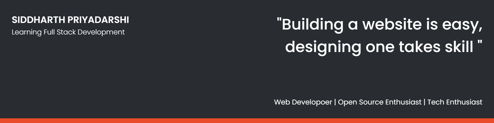

## 🧔 About Me

- 🌱 I’m currently learning **React, NodeJS**

- 👨‍💻 All of my projects are available at [https://github.com/siddharthPriyadarshi](https://github.com/siddharthPriyadarshi)

- 💬 Ask me about **HTML, CSS, JS, C, C++, JAVA, Python**

- 📫 Contact me **[here](sidmail4606@gmail.com)**

- ⚡ Fun fact **I am as fierce as an ice and as cool as fire 😉**

## ✍ My Work

## 📚 My Skills

-

## 🤝 Connect

